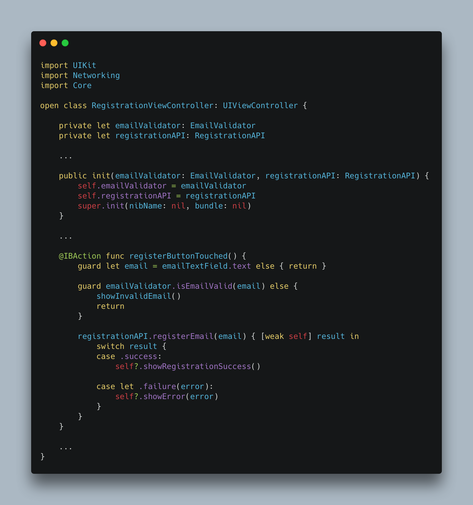
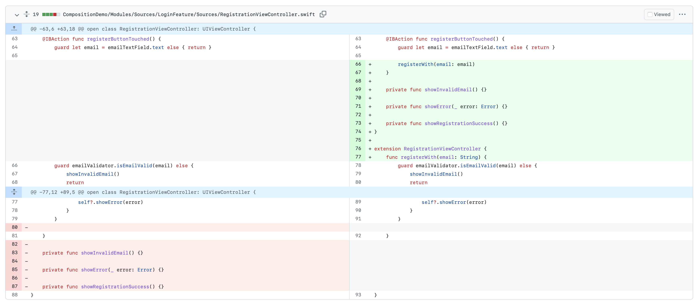
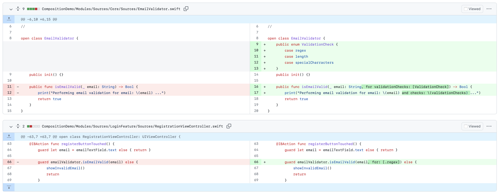
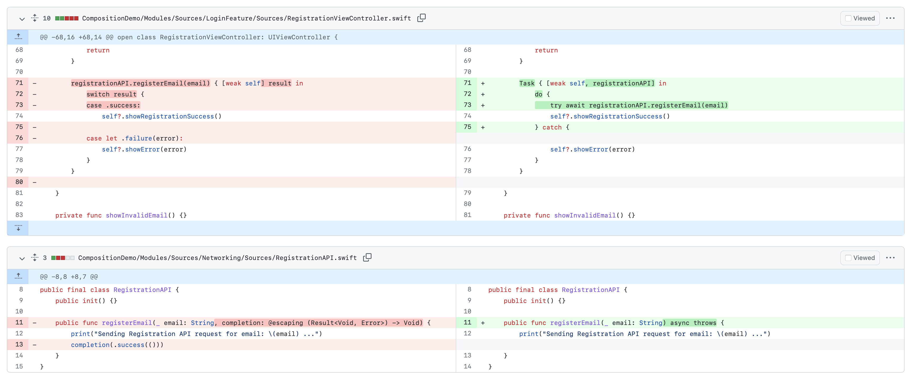
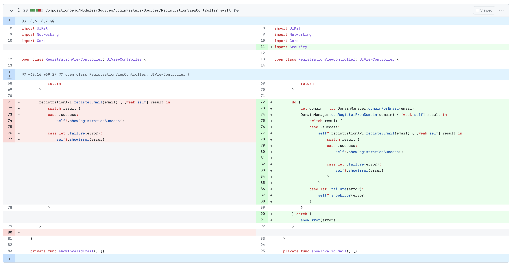
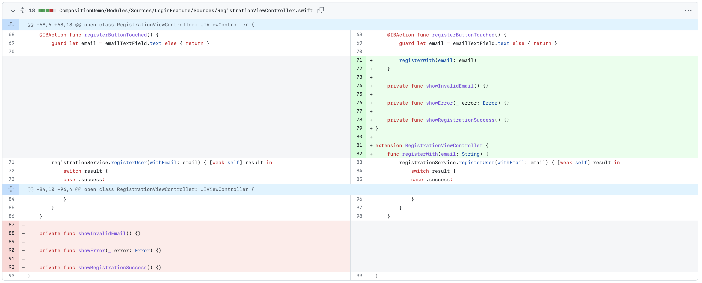
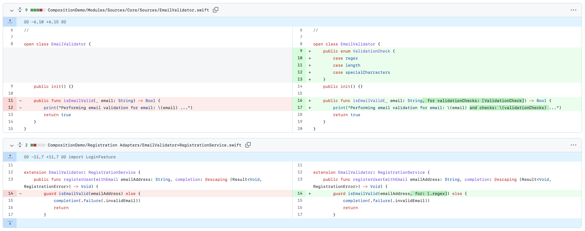
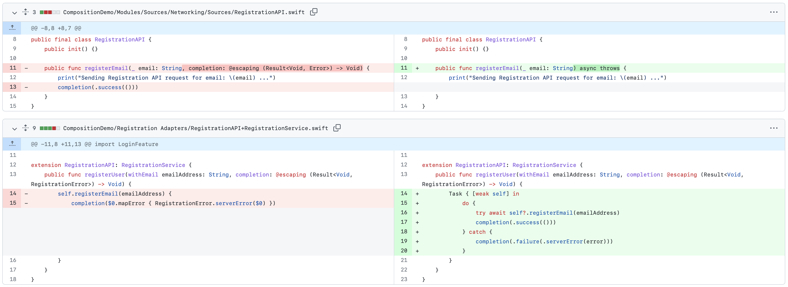
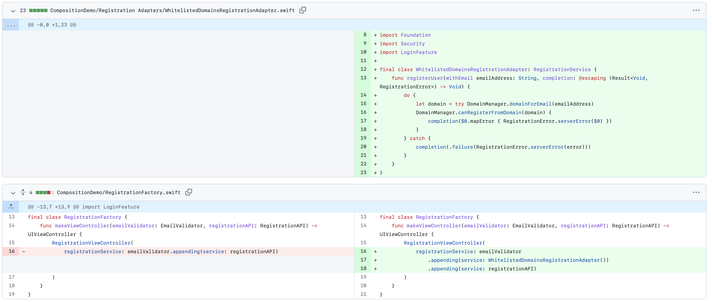

# Demo app showcasing SOLID principles

In this demo app I explore how SOLID principles can solve an issue of multiple teams working on same feature possibly creating merge conflict.

[You can also read Medium article for deeper explanation.](https://medium.com/@jiri.urbasek/applying-solid-principles-in-ios-development-74d197dc8d7b)

The demo app exhibits a `RegistrationViewController`, which is supposed to perform a user registration action. On call of`registerButtonTouched()` IBAction it performs local email validation and sends API request to register new user.

## Common implementation approach, not using SOLID

The typical implementation of the registration button logic can be seen in branch [no-solid](https://github.com/ibru/composition-demo/tree/no-solid) in [func RegistrationViewController.registerButtonTouched()](https://github.com/ibru/composition-demo/blob/8e60fdd46837e1485bb62c2d1e013832890cb80e/CompositionDemo/Modules/Sources/LoginFeature/Sources/RegistrationViewController.swift#L63)
It makes the `RegistrationViewController` be directly dependent on [EmailValidator](https://github.com/ibru/composition-demo/blob/no-solid/CompositionDemo/Modules/Sources/Core/Sources/EmailValidator.swift) and [RegistrationAPI](https://github.com/ibru/composition-demo/blob/no-solid/CompositionDemo/Modules/Sources/Networking/Sources/RegistrationAPI.swift) classes, which are stored in different modules.



Then I showcase 4 different pull request, which are implementing 4 different codebase improvements.

1. [Refactoring of RegistrationViewController](https://github.com/ibru/composition-demo/pull/4/files)



2. [Enhance local email validation](https://github.com/ibru/composition-demo/pull/1/files)



3. [Migrate RegistrationAPI public interface to use async/await](https://github.com/ibru/composition-demo/pull/3/files)



4. [Adding new functionality of checking for email domain](https://github.com/ibru/composition-demo/pull/5/files)



These improvements, even though they essentially happen inside different modules, all end up modifying same place - the method `RegistrationViewController.registerButtonTouched()`. And creating merge conflicts.

More over these improvements result in making `LoginModule` being dependent on even more external modules (adding dependency to `Security`) module which might lead to spaghetti dependencies, slow build times, harder reasoning about code.

## Improved implementation following SOLID

Then, [I refactor the `RegistrationViewController`](https://github.com/ibru/composition-demo/pull/2) logic to follow SOLID principles.

It seems like `RegistrationViewController` is getting too many responsibilities by directly depending on `EmailValidator`, `RegistrationAPI`, `DomainManager`, etc. It's definitely not a scalable solution for the future.

I solve it by expressing the act of registration by using protocol `RegistrationService`. So this is the only dependency the VC knows about. And does not care who and how exactly is it implemented.

```(swift)
public enum RegistrationError: Error {
    case invalidEmail
    case serverError(Error)
}

public protocol RegistrationService {
    func registerUser(withEmail emailAddress: String, completion: @escaping (Result<Void, RegistrationError>) -> Void)
}
```

Then I update `RegistrationViewController` accordingly

```(swift)
open class RegistrationViewController: UIViewController {
    
    private let registrationService: RegistrationService
    
    public init(registrationService: RegistrationService) {
        self.registrationService = registrationService
        super.init(nibName: nil, bundle: nil)
    }
    
    @IBAction func registerButtonTouched() {
        guard let email = emailTextField.text else { return }
        
        registrationService.registerUser(withEmail: email) { [weak self] result in
            switch result {
            case .success:
                self?.showRegistrationSuccess()
                
            case let .failure(error):
                switch error {
                case .invalidEmail:
                    self?.showInvalidEmail()
                
                case let .serverError(error):
                    self?.showError(error)
                }
            }
        }
    }
    ...
}
```

My registration logic requires that multiple components (`EmailValidator`, `RegistrationAPI`, `DomainManager`) work together to perform full functionality. But now I have only one protocol that represents all the logic.
I can solve it by separating the logic into small pieces, per component, and compose it together as I need.

Email validator conforms to `RegistrationService` separately:

```(swift)
extension EmailValidator: RegistrationService {
    public func registerUser(withEmail emailAddress: String, completion: @escaping (Result<Void, RegistrationError>) -> Void) {
        guard isEmailValid(emailAddress, for: [.regex]) else {
            completion(.failure(.invalidEmail))
            return
        }
        completion(.success(()))
    }
}
```  

API Service conforms to `RegistrationService` separately:

```(swift)
extension RegistrationAPI: RegistrationService {
    public func registerUser(withEmail emailAddress: String, completion: @escaping (Result<Void, RegistrationError>) -> Void) {
        Task { [weak self] in
            do {
                try await self?.registerEmail(emailAddress)
                completion(.success(()))
            } catch {
                completion(.failure(.serverError(error)))
            }
        }
    }
}
```

Now, to put it all together, I create helper types that peform composition of my needs. I create types [AppendingRegistrationService](https://github.com/ibru/composition-demo/blob/main/CompositionDemo/Registration%20Adapters/AppendingRegistrationService.swift) and [FallbackRegistrationService](https://github.com/ibru/composition-demo/blob/main/CompositionDemo/Registration%20Adapters/FallbackRegistrationService.swift) and compose the fuctionality inside my Factory type.
By using these helper types, I was able to make multiple pieces of functionality work together, while still be able to maintain them in isolation.

```(swift)
final class RegistrationFactory {
    func makeViewController(emailValidator: EmailValidator, registrationAPI: RegistrationAPI) -> UIViewController {
        RegistrationViewController(
            registrationService: emailValidator
                .fallback(service: WhitelistedDomainsRegistrationAdapter())
                .appending(service: registrationAPI)
        )
    }
}
```

Then I redo the same PRs once again.

1. [Refactoring of RegistrationViewController](https://github.com/ibru/composition-demo/pull/7/files)



2. [Enhance local email validation](https://github.com/ibru/composition-demo/pull/9/files)



3. [Migrate RegistrationAPI public interface to use async/await](https://github.com/ibru/composition-demo/pull/8/files)



4. [Adding new functionality of checking for email domain](https://github.com/ibru/composition-demo/pull/6/files)



Now the PRs, doing same changes as before, end up modifying different places in the codebase and do not create any merge conflicts.
More over they tend to get simpler and more isolated, resulting in greater control over source code changes, predictability of development and less chances of unintentionally breaking unrelated part of the app.

## SOLID principles applied in the codebase


### S-ingle-responsibility principle
"There should never be more than one reason for a class to change."

- the `RegistrationViewController` depending only on `RegistrationService`
- Registration adapters adapting interfaces one one class into interfaces needed for other class

### O-pen–closed principle
"Software entities ... should be open for extension, but closed for modification."

- modifying existing/adding new functionality by appending new service inside `RegistrationFactory`

### L-iskov substitution principle
"Functions that use pointers or references to base classes must be able to use objects of derived classes without knowing it."

- Using `AppendingRegistrationService`, `FallbackRegistrationService` and composing multiple `RegistrationService` implementation into a place where `RegistrationService` instance is expected

### I-nterface segregation principle
"Many client-specific interfaces are better than one general-purpose interface."

- not being used in this example

### D-ependency inversion principle
"Depend upon abstractions, not concretions".

- making `RegistrationViewController` depend on abstraction - the protocol `RegistrationService`, instead of concrete implementations of `EmailValidator`, `RegistrationAPI` etc.

